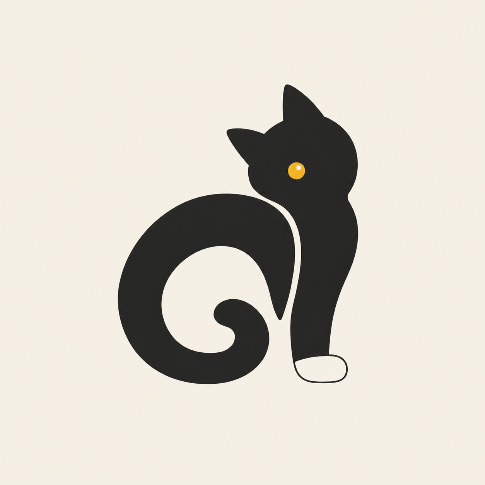
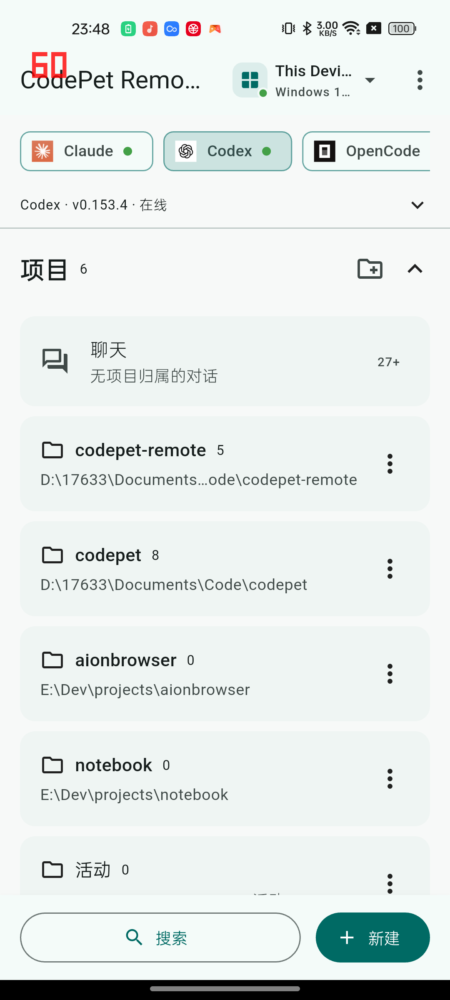
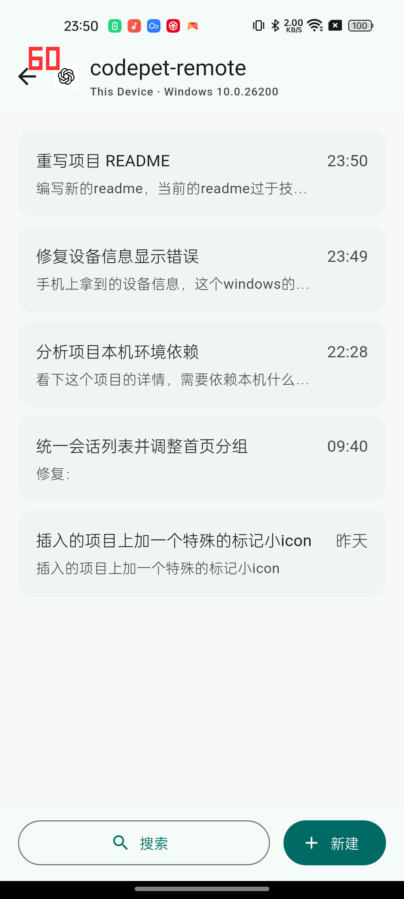
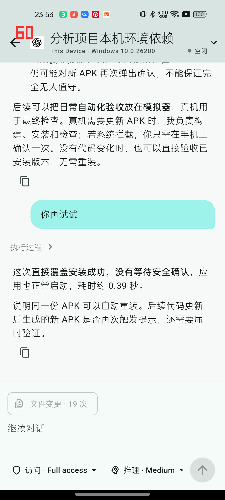
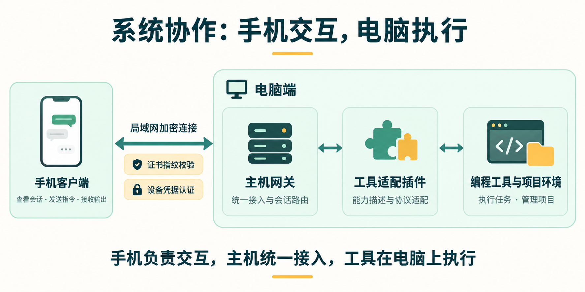
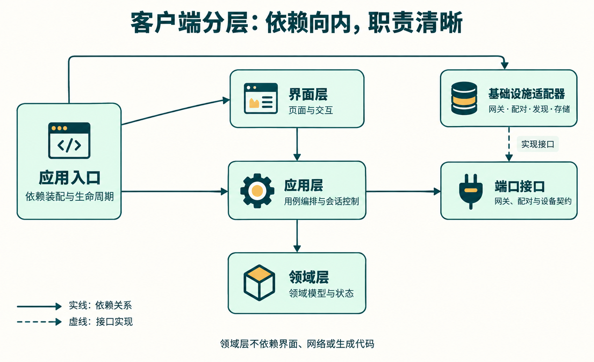

  
  <h1>CodePet Remote</h1>
  
<strong>离开电脑，也能接着推进你的 AI 编程会话。</strong>

  
在 Android 手机上连接 CodePet Host，查看进展、继续对话，让电脑上的工作触手可及。

  
  
  
  
  

  
<a href="#开始使用">开始使用</a> · <a href="#使用效果">使用效果</a> · <a href="docs/README.md">文档</a> · <a href="https://github.com/CodeKillerCoser/codepet-remote/issues">反馈问题</a>

## 为什么做 CodePet Remote

把任务交给 AI 编程助手之后，等待、查看进度、补充要求，往往仍把人留在电脑前。换到手机，原来的项目和会话又不容易接上；同时使用不同工具或多台电脑时，找到正在进行的工作也多了一层切换。

CodePet Remote 为 CodePet 提供一个手机入口：电脑上的 Host 负责连接 AI 工具与工作环境，手机负责呈现会话和传递操作。你可以在同一局域网内离开书桌，看看刚才的输出，再补上一句要求。

## 在手机上，你可以做什么

| 你想做的事 | CodePet Remote 的体验 |
| --- | --- |
| 找回刚才的工作 | 按设备、Provider 和项目浏览，或从最近会话与搜索进入 |
| 看看 AI 进行到哪一步 | 阅读历史消息、工具事件和持续更新的输出 |
| 接着往下做 | 在已有会话里发送消息，也可以创建新会话 |
| 调整本次任务 | 根据 Provider 支持的能力选择模型、配置会话，或中断正在执行的任务 |
| 管理不同电脑上的会话 | 配对多个 Host，在同一个客户端中切换 |
| 快速连接自己的设备 | 扫描 Host 二维码，也支持粘贴配对内容或输入配对口令 |

功能由 Host 及其 Provider 插件实际提供。客户端会根据能力开放操作；不同工具的模型、权限和会话选项可能不同。

## 使用效果

<table>
  <tr><th>设备与项目</th><th>项目内会话</th><th>继续对话</th></tr>
  <tr>
    <td></td>
    <td></td>
    <td></td>
  </tr>
</table>

以上为 2026-09-08 在已连接 Android 手机上截取的实际界面，内容来自当时的 Host；左上角红色数字是手机的刷新率叠加显示。

一个典型流程：在电脑上开始任务 → 手机上找到最近会话 → 查看新增输出 → 补充下一步要求。会话仍由 Host 管理，实际执行留在电脑上的工具环境中。

## 开始使用

当前面向 **Android + 局域网连接**，项目仍在持续开发。使用前需要一台运行兼容版本 CodePet Host 的电脑，并在 Host 上配置好需要使用的 Provider。

1. **安装客户端。** 从 [Android APK 工作流](https://github.com/CodeKillerCoser/codepet-remote/actions/workflows/android-build.yml)的成功运行中下载可用的 APK artifact，解压后安装。Artifact 保留 14 天，下载通常需要登录 GitHub；没有可用产物时，可按[构建指南](docs/android-build.md)自行打包。
2. **准备 Host。** 让手机与电脑处于可互通的同一局域网，在 Host 中开启配对并显示配对二维码或口令。
3. **配对设备。** 在手机中添加设备，扫描二维码；也可粘贴完整二维码内容，或选择发现的 Host 并输入其 6 位配对口令。
4. **打开会话。** 选择设备和 Provider，进入项目或最近会话，查看输出并继续交流。

Host 需要保持运行、网络可达，相关 Provider 需要可用。当前不承诺公网直连、iOS 支持或手机断连后任务持续运行；具体执行生命周期见[架构文档](docs/architecture.md)。WebRTC、文件传输和网页产物预览仍处于[设计提案](docs/resource-uri-and-file-transfer.md)阶段。

## 技术选型

技术选择围绕三个目标展开：适合手机的交互、可靠的跨设备会话同步，以及可独立扩展的工具接入。

| 领域 | 当前选型 | 在项目中的作用 |
| --- | --- | --- |
| 客户端 | Flutter + Dart，当前交付 Android | 构建项目列表、消息时间线和会话操作界面；核心用例使用纯 Dart，便于独立测试 |
| 通信 | WSS + JSON-RPC 2.0 | 在一条加密连接上传递请求、响应和实时事件，持续呈现任务进展 |
| 协议契约 | JSON Schema / manifest + 生成的 CodePet SDK | 统一跨端消息类型，减少客户端与 Host 各自维护协议产生的偏差 |
| 发现与配对 | mDNS、二维码 / 配对口令、HTTPS 配对 | 在局域网发现设备，通过配对建立信任，并支持地址变化后的重新连接 |
| 凭据与存储 | Android 安全存储 + SharedPreferences | 敏感凭据与普通设备信息分开保存，会话内容只在内存中维护 |
| 消息同步 | 历史快照 + 事件流 + 有界会话缓存 | 先显示一页历史，再接收增量输出；按需加载更早消息，减少重复拉取 |
| 质量保障 | Flutter Analyze、Flutter Test、GitHub Actions | 检查代码、验证分层与业务行为，并自动构建 Android APK |

环境版本和依赖以[开发指南](docs/development.md)与 [pubspec.yaml](pubspec.yaml) 为准。

## 架构设计

### 系统协作：手机交互，电脑执行

**Remote 管交互，Host 管接入，Provider 对接工具。** 手机通过统一 Gateway 访问会话，不需要分别适配每种工具的原生协议。连接层可以独立扩展，界面与会话逻辑继续复用。

局域网连接采用 TLS 加密，配对时绑定 Host 证书指纹，设备凭据保存在 Android 安全存储中。会话和消息不写入客户端普通持久存储；AI 工具自身的数据处理与网络访问由 Host 和 Provider 决定。详细说明见[连接与安全边界](docs/connection-and-security.md)。

### 客户端分层：业务与接入方式解耦

客户端采用依赖向内的分层架构。界面调用应用用例，用例依赖稳定领域模型和端口接口；网络、配对与存储在外围实现这些接口，由应用入口统一装配。

图中的实线表示依赖关系，虚线表示接口实现。核心领域不依赖 Flutter、网络或生成 SDK，界面也不直接处理连接和凭据。

| 设计重点 | 如何实现 | 带来的效果 |
| --- | --- | --- |
| 多工具接入 | Provider 在 Host 侧适配工具，Remote 消费统一协议和能力描述 | 界面根据实际能力开放操作，减少对特定工具的绑定 |
| 连接方式可扩展 | Channel 负责传输，Admission 负责配对准入，Gateway 负责业务映射 | 后续扩展连接方式时，可以复用会话用例和界面 |
| 历史与实时输出衔接 | 使用快照游标划定事件窗口，去重后将增量输出投影到时间线 | 减少历史加载与实时输出交错造成的重复消息 |
| 会话状态集中管理 | 每台 Host 由 DeviceSession 管理连接、重连和缓存，详情控制器管理交互与分页 | 页面切换可复用有效缓存，断连后丢弃失效状态 |
| 边界可验证 | 自动化分层测试限制跨层导入 | 在持续迭代中保持界面、业务和基础设施的职责清晰 |

完整的交互生命周期、缓存淘汰、心跳和失败恢复策略见[架构文档](docs/architecture.md)。WebRTC 等未来接入方案仍以提案状态单独记录。

## 文档与参与

想了解实现、自己打包或排查问题，请从[文档导航](docs/README.md)开始：

- [开发指南](docs/development.md)：环境、运行、目录结构与开发约束。
- [Android 构建与发布](docs/android-build.md)：GitHub Actions、APK 与签名配置。
- [架构设计](docs/architecture.md)：分层、会话生命周期与事件同步。
- [日志与排障](docs/diagnostics.md)：日志导出与跨端 Trace 分析。

欢迎提交 [Issue](https://github.com/CodeKillerCoser/codepet-remote/issues) 描述使用场景、问题和改进建议，也欢迎通过 Pull Request 改进代码和文档。反馈问题时请附上复现步骤及 Remote / Host 版本，并移除日志中的个人信息。提交贡献前，请阅读[许可说明](docs/licensing.md)。如果这个项目对你有帮助，欢迎点一个 Star。

## 许可：允许修改，禁止商用

CodePet Remote 采用 [PolyForm Noncommercial License 1.0.0](LICENSE)。在该许可允许的非商业目的下，你可以使用、研究、修改和分发本项目；分发时须附上许可文本或其链接，并保留 [NOTICE](NOTICE) 中的必要声明。

**本许可不授予商业使用权。** 修改或二次分发不会解除非商业限制。商业使用需要另外取得相关权利人的授权。

由于包含非商业限制，本项目属于 **源码可用（source-available）**，不属于 [OSI 定义的开源软件](https://opensource.org/osd)。上述内容为简要说明，具体适用范围（包括许可列明的组织用途）、第三方组件和贡献约定见[许可说明](docs/licensing.md)，正式条款以 [LICENSE](LICENSE) 为准。
