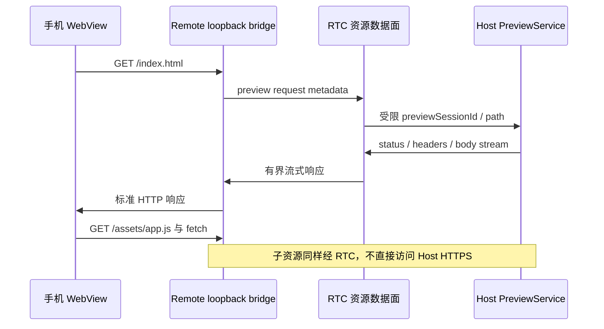

# 资源 URI、Host 文件挂载与 WebRTC 预览传输方案

> **2026-09-09 范围调整：暂缓。** 当前实施只新增 WebRTC 连接通道，保留现有 LAN HTTPS/WSS；文件挂载、预览、上传下载和网页代理不进入本轮。本页保留为后续设计，不是当前交付清单。当前通道计划见 Host 仓库 `knowledge/20-product/webrtc-channel-delivery.md`。

## 背景

状态：**设计提案，尚未实现**。2026-09-08 根据用户确认的 WebRTC 连接方向修订。本次只修改文档，不实施 Host/Remote 代码、依赖或部署。

配套连接主方案位于 CodePet 仓库 `knowledge/10-architecture/remote-webrtc-datachannel-proposal.md`，负责 WebRTC 引入、信令、准入、WSS 迁移和既有 21 个请求。本页负责文件资源域，阅读时使用同日期版本。

原方案拟先做独立 HTTPS 数据面，再增加 RtcBlobAccess。当前目标改为：**控制元数据通过 Gateway JSON-RPC，文件和网页 body 直接通过 WebRTC 独立字节流**。LAN HTTPS 可以继续承担配对/本地信令；不再建设跨设备 HTTPS 文件传输。被预览网页的 HTTP/WebSocket 是两端本地适配语义，不是恢复业务 WSS。

## 目标

- Host 上已授权的目录、图片、文件和网页产物可被手机查看、下载/保存；上传有独立授权和原子提交。
- 文件引用不随 Host IP、信令地址或 TURN 节点变化而失效。
- 大文件支持流式落盘、版本一致的范围读取和续传，不把全部字节放入手机内存。
- 静态 HTML、CSS/JS/图片、SPA 和声明支持的 dev-server/HMR 可在手机 WebView 运行。
- 保留 Host 唯一 mint/resolve、结构化边界转换、控制/数据分离、身份/定位分离。

## 非目标

- 不是 SMB/NFS/FUSE 或把 Host 整盘挂成手机磁盘；不提供公网匿名分享。
- 不将文件上传到信令服务器，不将文件内容编码成 JSON-RPC base64。
- 不默认远程写入、执行上传文件、任意端口转发或访问未授权 dev-server。
- 不保证任意 Office 格式、网站 SSO、Service Worker、跨域服务在首版完整运行。
- 手机后台下载、iOS 支持须平台专项验证，不承诺进程被杀后自动恢复全部任务。

## 现状理解

### 证据

检查 Remote commit `3f200650446d3752efcd9f4be6d1bbf10e58fb08` 和 Host commit `4e32b87fc26fbd3b40ef313f5c70ef93d6aa5097`：

- 本页原版只有设计；未在 Remote lib/test 中发现 BlobAccess、CodepetImageProvider 或 preview mount 实现，pubspec 未包含 flutter_webrtc/flutter_inappwebview。
- `lib/gateway/transport.dart` 已有 connect/request/events/close；`lib/gateway/gateway_client.dart` 使用生成 SDK。
- `lib/features/conversations/widgets/conversation_timeline_view.dart` 是资源内容上屏的相关入口，不能在 widget 中直接读取 bearer/网络连接。
- `docs/architecture.md` 和 `test/architecture/layering_test.dart` 要求 feature→application→domain；I/O/SDK 在外围 adapter。
- Host Gateway manifest 当前没有 resource/preview 方法，原资源提案不能被当作已经部署的 HTTPS API。
- Host 现有设备 credential 只代表设备接入。文件导出范围、upload grant 和 preview target 还需新建授权模型，不能假设所有项目能力等于任意文件权限。

### 修订对照

| 原设计 | 本次保留/修订 |
| --- | --- |
| Host 唯一 mint/resolve | 保留；Provider 只声明候选，最终引用由 Host 资源服务创建 |
| 两种 codepet URI | 保留外形，path 形式增加明确 mount namespace 规则 |
| Remote Markdown hook | 保留识别入口，改为请求 Host resolve；不自行 mint URI |
| 独立 HTTPS body | 替换为 RTC 字节流；JSON-RPC 仍只携带元数据 |
| HttpsBlobAccess 后接 RtcBlobAccess | 直接以 RtcBlobAccess 为目标实现 |
| WebView pin + 子资源拦截 | 改为原生 loopback HTTP/WS bridge，权限在已认证 RTC/session 上校验 |
| Agent 挂载工具 | 保留，但工具权限来自明确导出 policy，不是任意路径授权 |
| 上传边界未知 | 明确 write grant、临时文件、commit、冲突和取消 |
| HTML 内嵌链接暂缓 | 静态预览必须覆盖正常相对/根路径子资源；不做全文链接替换，绝对 dev-server URL 用显式 adapter |

## 实现路径

### 1. 核心不变式

1. **唯一 mint：**Host ResourceService 创建 canonical URI/token；Provider 和 Remote 只能提交候选路径/引用。
2. **唯一 resolve：**Host 把 URI 解析为授权 mount/registry 条目。Remote 可以识别 scheme/deviceId/语法并路由到设备 session，但不解析 token 或映射实际磁盘路径。
3. **结构化转换：**仅在 ToolContent.uri 等字段和 Markdown AST/imageBuilder/onTapLink 切面处理，不修改整段 Markdown，不扫描所有普通文字。
4. **控制/字节分离：**JSON-RPC 只包含元数据/授权/ticket；原始 bytes 经独立流。
5. **身份/定位分离：**URI 不含公网 IP、端口、ICE candidate、signal token 或 bearer。
6. **引用不等于授权：**有效 URI/token 仍需有效 peer credential、资源 scope 和动作权限。
7. **流与任务分离：**关闭预览/取消下载不停止 AI turn；PeerConnection 多流也只登记一次在线 presence。

### 2. URI 与路径命名空间

仅保留两种外形：

| 形式 | 语法 | 含义 |
| --- | --- | --- |
| path | `codepet://<hostDeviceId>/content/<relpath>` | resolve-by-path，relpath 首段固定为 mountId，其后为 mount 内相对路径 |
| token | `codepet://<hostDeviceId>/encrypt/<token>` | resolve-by-id，token 为 registry opaque ID |

例如 Host 返回 `codepet://<hostDeviceId>/content/<mountId>/dist/index.html`；Remote 不因知道 mountId 就自己生成已授权链接。URI 类型不是 image/file/web-preview 的分类容器，类型由元数据决定。encrypt 为沿用名称，不代表 token 是加密密文。

mountId 在一个 Host 内唯一、持久且不从绝对路径推导；同名工作区通过不同 mountId 区分。其关联 providerPluginId/providerInstanceId/project route 存在 Host metadata，不能依赖当前 UI 选中哪个项目解析 URI。

旧草案中没有 mountId 的 path URI 语义存在多根歧义；当前未发现已实现 URI 数据，首个实现直接使用上述规则。若后续发现真实历史数据，禁止猜默认工作区，应重新 resolve 或显示“需要重新生成引用”。

Host 路径解析：按 URI 规则一次解码、分段验证、拒绝绝对路径、..、NUL、编码斜杠绕过和二次解码；Windows 另拒绝 drive/UNC/设备路径/ADS。最终使用限根文件打开，处理 symlink/junction/重解析点和 TOCTOU。首版可默认不跟随导出根内符号链接；不能只用 startsWith 检查路径字符串。case/分隔符规则由 Host 平台 adapter 处理。

### 3. Host 挂载与授权

“挂载”对应本机导出记录，不是 OS mount：

```text
Mount {
  mountId, hostDeviceId, ownerRoute?, displayName,
  source: directory | staticPreview | devServer,
  rootPath? | fixedLoopbackTarget?,
  allowedClientIds, allowedOperations, policyRevision,
  createdAt, expiresAt?, revokedAt?
}
```

- 默认只读，只导出用户选择的项目/产物目录。provider 的 cwd 只是候选上下文，不自动授予全盘导出权限。
- mount/list/read/upload/preview 的动作独立；allowedClientIds 可选取已配对设备集合，但新增设备不能自动继承敏感导出。
- Host UI 管理创建/撤销/权限，Agent 工具只能在预授权根内注册产物；越界请求交 Host 确认，不因为 Agent 声明就放行。
- 静态模式固定目录根；dev-server 模式固定协议/IP/端口，默认只连接 Host loopback。不接收 Remote 提供的任意 URL，不通过 DNS 重绑定变成私网代理。
- mount 生命周期与 Provider 插件进程解耦；Provider 重启不重建身份。源目录消失显示 unavailable；重新授权/更换根增加 policyRevision 并作废旧 ticket。
- 撤销 mount 立即拒绝新 open，取消全部关联 stream/preview；文件仍在磁盘也不延长授权。

拟议 Host-local 工具 `resource.register` / `preview.register` 由 Host 校验，返回 canonical URI 和 metadata。通过 Harness 支持的工具机制注入；不同 Harness 的注入能力需实际核对。工具不授予额外目录权限，也不把 mint 放到多个 Provider adapter 中。

### 4. Content registry 与生命周期

Host 唯一 registry：

```text
token -> {
  source: mount-relative path | managed bytes | preview registration,
  resourceKind, mimeType, displayName, totalBytes?,
  ownerRoute?, scope, version, createdAt, expiresAt, revokedAt?
}
```

- token 高熵不可猜，但不是 bearer；每次 resolve/open 复核 credential/scope/operation。
- sourcePath 不回传手机；name 仅用于显示/建议保存名，不可参与未经净化的写入。
- 临时 registry 使用 TTL、访问时校验和有上限 GC；正在传输也有 lease 上限。token 过期后不被访问自动续命。
- mount 的 path URI 可长存，但访问时取最新授权；临时 token 过期返回 resource_expired，不偷偷 mint 新资源。
- raw bytes 落受管临时存储，不无界驻留内存；大小/项数/磁盘预算均限制。
- Host 重启保留 mount 配置；临时 transfer/preview session 全部失效。需要持久分享的资源是后续独立能力，不自动保存无限历史 token。

### 5. 资源控制 API 与数据流协议

以下为拟议 Gateway 新方法，加入 Host canonical schema/manifest 后生成 Rust/Dart SDK；不得在 Remote 手写第二套 wire DTO：

| 方法 | 关键输入 | 输出/语义 |
| --- | --- | --- |
| `resource.resolve` | 候选 URI/结构化路径、ownerRoute、来源上下文 | canonical URI、元数据；拒绝模糊基目录和越权路径 |
| `resource.stat` | canonical URI | kind/MIME/name/size/version/allowedOperations |
| `resource.list` | 可选 parent（已授权 mount/目录引用）、cursor/limit | 无 parent 时列当前 client 可见的导出根；有 parent 时列目录；引用均由 Host 创建，不泄露绝对路径 |
| `resource.openRead` | URI、expectedVersion、offset/length | read ticket、streamId、范围、version、过期时间 |
| `resource.openWrite` | write grant、mount-relative target、size、冲突条件 | uploadId、write ticket、已落盘 offset/版本 |
| `resource.commitWrite` | uploadId、最终大小/digest、目标条件 | 原子完成后 canonical URI |
| `resource.cancel` | lease/uploadId | 幂等取消，不触碰 turn 状态 |
| `preview.open` | Host 创建的 preview URI | previewSessionId、模式、允许能力、TTL |
| `preview.close` | previewSessionId | 幂等关闭并回收关联流 |

对 capability 不支持的旧 Host，UI 显示能力不可用，而不是试探 HTTPS URL。资源访问是 Host 能力，不冒充 Provider 方法，也不修改原有 routed conversation/project 的语义。

**ticket 绑定：**credentialId/clientId、当前 peer generation、resource/mount、policyRevision、operation、version、允许范围、TTL。ticket 仅能用于分配的 streamId，一次 attach；断线重连不能拿旧 ticket 接入新 PC。

字节 transport 遵循主方案的 DuplexByteStream 接口和 credit 限额。逻辑控制帧 OPEN/ACCEPT/ERROR/FIN/CANCEL 与原始 DATA 明确区分；OPEN 使用有界 channel metadata，DATA 不经过 JSON-RPC。一个 RPC open 成功后，匹配的 data channel attach 有超时；未 attach 回收 lease。反向到达、重复 attach、越界 offset、零窗口继续发均拒绝。

版本/digest/range/end 状态必须可验证，不能把 DataChannel close 当下载完成。EOF 后仍需校验预期总长度及摘要，FIN 被重复收到不重复提交。压缩文件和图片不再默认二次压缩。

### 6. 文件浏览、下载和续传

用户流程：会话中的资源卡片或设备“已共享文件” → stat/list → 可用预览 → 保存/下载；目录树只能从 Host 返回的 mount/条目展开，不提供任意绝对路径输入。

读取状态：
`resolving → authorized → opening → transferring → verifying → completed`；
失败、取消、断线可进入明确终态或 resumable，不把下载失败混进会话发送失败。

- 文件分块写手机私有 .part 文件，UI 仅消费进度；完成校验后 rename，再由系统保存/分享 API 导出。
- saved filename 过滤路径分隔符/保留名，重名由用户选择或生成安全新名。临时缓存与用户主动保存的文件分开。
- 下载续传记录 resource URI/version、已确认连续 offset、临时文件校验信息。重连取得新 ticket，续读同一版本；version 变化返回 resource_version_changed，必须重下或另存新版本。
- version 不能只承诺 mtime+size 绝对可靠。可变工作文件若要求强一致下载，Host 生成受配额约束的稳定快照并计算 digest；拒绝无空间快照，不拼接变化中的内容。
- 短预览可对当前打开文件句柄读范围，变化时停止并重新 resolve；大文件强一致模式成本必须可见。
- 磁盘不足、长度不符、摘要失败、取消、授权撤销均不发布半文件；保留/删除 .part 依产品动作和 TTL，不无限堆积。
- 删除本地配对清理其临时 cache/票据；已经导出系统目录的文件不能被远程撤销收回，UI 不承诺“撤销即删除所有副本”。

### 7. 图片、文本、PDF 与 Markdown

| 内容 | 首版体验 | 限制 |
| --- | --- | --- |
| 图片 | CodepetImageProvider 通过 BlobAccess；缩略图/全图按需 | 限像素和解码内存，按目标显示尺寸解码，失败可下载 |
| 文本/代码/Markdown | 有界范围读取、编码识别、长文件分页/截断提示 | 截断是预览行为，原文件下载保持完整 |
| PDF | 受控本地缓存 + PDF viewer | 插件/按需读取需验收，不能把 WebView 默认支持 PDF 当事实 |
| 音视频/Office/未知格式 | 下载/系统打开为基线 | 不承诺首版内嵌所有格式 |
| HTML/网页 | 独立 preview session | 不在聊天富文本中执行脚本 |

Markdown 的 imageBuilder/onTapLink 根据 scheme 分发：

- codepet URI：识别 deviceId，交对应已配对 session 和 Host resolve，禁止跨设备 token 混用。
- 原生相对/绝对文件路径：必须携带来自会话的明确项目/mount 候选上下文，交 Host 判定；缺失上下文显示不能解析，不猜某个 provider cwd。
- 普通 http(s)：按现有外链策略访问，绝不附带 Host bearer。
- HTML 内嵌资源不靠 Markdown 全文改写解决；在网页 preview 中由正常 URL 解析和 bridge 处理。

与架构规则对齐：domain 定义 ResourceUri/ResourceMetadata/ResourceVersion；application/ports 定义 BlobAccess/PreviewAccess；application 管理下载/预览用例和链接 policy；外围实现 RtcBlobAccess、图片 provider、WebView；feature 只呈现状态与动作。

### 8. 上传与写入提交

上传为独立授权，不因已配对或能读某 mount 就允许写。Host UI 或预设 policy 签发限定目标根/文件类型/字节配额/TTL 的 write grant。

`openWrite → stream to temporary → verify → commitWrite → published`

- 目标先做与读相同的限根安全检查。临时文件位于受管目录/目标同卷安全暂存区，不使用用户输入直接构造任意路径。
- 默认 create-only；覆盖需 expectedVersion 和显式授权。rename 原子性依平台/同卷确认，不满足条件时使用可恢复提交策略，不能承诺跨卷 rename 原子。
- uploadId 带客户端 operationId；重复 open/commit 对同意图返回当前状态，语义在 schema 明确。不同大小/目标/digest 不得复用一个 ID。
- 流 ACK 表示已接受窗口；可续传 offset 只报告已可靠落盘的连续范围，不能把 socket 已接收量当持久进度。
- commit 验证大小/digest/目标版本与仍有效 grant；成功后才 mint 引用。commit 响应丢失通过同 uploadId 查询/重复提交获取稳定结果，不再次写另一份。
- 首版 Host 重启可令未提交 upload 失效并 GC；跨重启续传需要额外持久 journal，未实现前明确提示重新上传。已完成 commit 的恢复记录必须避免短时重复发布。
- 取消/过期/撤销不撤销已成功发布的文件；删除已发布内容是另一个明确操作，本阶段不自动提供任意删除 API。

### 9. 静态页面挂载与本地 bridge

静态挂载固定 root/entry 和可选 SPA fallback。Host 工具返回 preview URI，手机用 preview.open 取得会话。



Remote 自有 loopback bridge 将浏览器标准请求映射成 preview 数据面交换；不能只处理首个 loadUrl。它不是简单把文件先全部下载再打开，也不是云端发布。

- 每 preview 独立 origin/端口；绑定 127.0.0.1，不监听 0.0.0.0。随机 bootstrap token 建立本地短期会话，剥离初始 URL token，Host/Origin/Referer 校验配合跨站请求防护。
- 单靠端口不能隔离 cookie（cookie 不按端口隔离）。使用独立 WebView 数据存储/受控 cookie 隔离机制；若平台不支持多 profile，首版限制同时一个活动 preview 并在切换时清理，禁止宣称多项目 cookie 已天然隔离。
- preview token 只允许该注册目标；WebView 不取得业务 bearer、任意 Host RPC 或 native 文件 API。
- 处理 GET/HEAD、MIME/charset、ETag/If-None-Match、单 Range/Content-Range、404/416；多 Range 可先明确拒绝，不无界组合响应。
- 根路径资源与相对资源由单 origin 自然解析；SPA fallback 仅 HTML 请求，不把缺失 JS 返回 index.html。
- CSP/外部资源策略按 mount 声明；默认不允许任意外部网络和外部导航。下载动作回到原生资源用例，不能由网页借系统 API读取 Host 其他路径。
- 禁用通用 JavaScript native bridge、文件 scheme 任意读取；不继承 App 的登录 cookie/存储。插件 cleartext loopback 配置不能放宽到所有网络。
- Service Worker 首版禁用或隔离清理；端口复用可能恢复旧 origin 状态，需要明确销毁/清理行为。

插件 InAppLocalhostServer 只提供本地资产服务，不直接实现上述动态 RTC bridge。Android/iOS WebView 能力不同，当前仅 Android 工程可作为首发验收目标。[Android 本地内容](https://developer.android.com/develop/ui/views/layout/webapps/load-local-content)、[InAppWebView localhost](https://inappwebview.dev/docs/in-app-localhost-server/)

### 10. dev-server、HTTP 与 WebSocket/HMR

Host dev-server mount 只代理固定 loopback target，不按浏览器提供的任意 host 连接。保留 dev-server 自身授权规则，不关闭其全部 Host/origin 校验。

预览 exchange 至少支持：

| 类别 | 规则 |
| --- | --- |
| 请求 | exchangeId、previewSessionId、method、相对 path/query、允许 headers；body 独立流 |
| 响应 | status、允许 headers、body；长度和流式完成状态明确 |
| HTTP headers | 剥离 hop-by-hop 与业务 Authorization；Host/Cookie/Location 按 preview policy 映射 |
| redirect | 只允许注册 origin 内或明确许可的外链，不把 127.0.0.1 直接发给手机 |
| cookie | origin/profile 隔离、限定名称/域/path；不复用 App cookie |
| 动态请求 | 方法 allowlist；POST 等可能有副作用，网络失败不得自动重发 |
| streaming | chunked/SSE 以持续字节流适配，窗口反压传到上游，关闭页面取消 |
| WebSocket | 明确 upgrade、subprotocol、binary/text、message/close 语义；HTTP connection header 不作为普通元数据透传 |
| 禁止能力 | 通用 CONNECT、任意 DNS/私网地址、未登记端口、默认携带系统环境凭据 |

HTTP 是元数据 + 有界 body 的隧道语义，不是把请求字符串无限送到任意 TCP socket。WS adapter 两端分别终止本地 WebSocket，再用 versioned message envelope 通过 duplex byte stream 保留 binary/text/message boundaries/close code；单消息有上限，不能丢失边界把两个 message 拼成一个。

```text
WebView WebSocket
 → Remote loopback WS endpoint
 → RTC duplex stream
 → Host preview WS adapter
 → 已注册 dev-server WebSocket
```

HMR client 必须连接手机可见 origin。Vite 等工具的 hmr host/clientPort/protocol 或 base/public origin 由挂载配置/已验证 adapter 处理，不承诺对所有构建工具任意源码做全文替换。绝对指向 Host localhost 的资源必须显式映射，无法映射显示能力限制。静态预览和 HMR 是两个验收里程碑，后者失败不能伪报页面实时更新成功。

**业务 WSS 删除后仍能有 HMR WebSocket**：它仅存在于“手机网页↔手机 bridge”和“Host bridge↔dev-server”两个本地段，中间跨设备段始终是 WebRTC。

### 11. 状态、错误和资源预算

拟议领域错误：resource_not_found、resource_expired、resource_forbidden、mount_unavailable、resource_version_changed、range_invalid、quota_exceeded、upload_conflict、preview_unsupported、stream_cancelled。名称须在 canonical schema 固化；目前不是已发布 error code。

- 不把 forbidden 显示成网络重试，不在无权限时泄露实际文件路径。
- 资源重试与 DeviceSession generation 对齐；旧 ticket 不换绑新 PC，旧下载回调不覆盖新 UI。
- 限活动流/等待任务/窗口/磁盘 cache；按主方案初值起步，preview 子资源最多与其它资源共用 8 个 active stream，超额有界排队。
- 控制心跳与流信用反馈不在文件队列后等待；取消/关闭要唤醒等待窗口的 reader/writer。
- 下载/上传/preview deadline 分开；持续有进度的大文件不套普通 15 秒 RPC 总时长，但无进度有超时。
- 缓存 key 至少含 hostDeviceId/canonical URI/version；不同 Host 同文件名不能复用 bytes。
- 日志只记录操作类型、字节数、耗时、版本是否改变、失败分类；不记录 bearer/token/内容/实际根路径。

## 涉及模块

| 模块 | 原因与变化 |
| --- | --- |
| Host resources/ | 新建 mount registry、路径安全、token/版本/配额、读写 lease |
| Host previews/ | 静态/固定 dev-server、HTTP/WS message adapter |
| Host remote/access/connections | credential/mount revoke 联动所有资源流 |
| Host gateway + canonical protocol | 新 resource/preview typed 方法、capability、错误/DTO |
| Host Tauri/Provider 集成 | 本机导出授权、受限 Agent 注册工具，无任意路径自动授权 |
| Remote core/domain | URI/metadata/version/transfer state 等纯值对象 |
| Remote application/ports | BlobAccess/PreviewAccess，符合当前架构层级 |
| Remote application | 链接 policy、浏览/读写/下载提交/预览用例 |
| Remote 外围 adapters | RtcBlobAccess、图片解码、磁盘/系统保存、loopback/WS bridge |
| Remote features/conversations | 内容 kind 分发、预览/保存/取消/失败交互 |
| Remote app / Android / pubspec | 依赖与平台组合、WebView/权限，不在通用 widget 散落平台判断 |

## 风险

| 风险 | 对应验证 |
| --- | --- |
| 多工作区同名文件串用 | mount namespace、ownerRoute、跨 Host/cache key 测试 |
| 路径遍历/符号链接/竞态 | Windows/Linux/macOS adapter 的根内打开、junction/symlink/rename 攻击 |
| token 被复制即越权 | 不同 credential/client、TTL/revoke/policyRevision 的拒绝测试 |
| 大文件撑爆手机内存 | 大于可用内存的文件下载，测实际 RSS/缓冲/磁盘，并发预览和 ping |
| 续传拼接不同版本 | 同大小/mtime变化、边读边写、expectedVersion/digest 校验 |
| 上传半文件/重复提交 | EOF/cancel/响应丢失/冲突/Host 重启/同 uploadId 重复 commit |
| 预览跨 origin/cookie 泄漏 | 双项目、外部网页访问 loopback、cookie 跨端口、旧 profile/端口复用 |
| dev-server 变开放代理 | 任意目标/redirect/DNS/CONNECT/私网请求拒绝 |
| HTML 能开但子资源失败 | module/CSS/fetch/Range/SPA/WS/HMR 真实页面 |
| 文件取消影响 AI 任务 | cancel file 保持 turn/ping；credential revoke 则关闭全部资源 |
| schema/端口越层 | generator freshness 和 Remote layering_test，禁止 feature 访问 SDK/网络/凭据 |

## 测试计划

1. 协议 fixtures：两种 URI、mountId 编码、所有新方法及错误、ticket 绑定、OPEN/FIN/CANCEL/窗口、字节范围。
2. Host 单测：根内路径、registry TTL/GC、grant/撤销、版本快照、Range、上传原子提交、代理白名单。
3. RTC 集成：同 LAN 与强制 relay、大文件/慢接收、断线续传、控制 ping 和事件持续、旧代 stream 拒绝。
4. Remote 用例/widget：图片/文件/不支持格式、保存权限/磁盘不足、取消/过期、设备忘记、320px/横屏/键盘焦点。
5. Preview 真机：HTML/CSS/ES module/图片、相对和根路径、SPA、fetch POST 不自动重发、SSE、WS binary/text/close、HMR、Cookie/CSP。
6. 生命周期：App 后台→前台、Host 退出/重启、mount/credential 撤销、VPS 只停信令/只停 TURN，失败状态一致。
7. 实施后运行 Host 相关 resource/preview/RTC 测试、protocol:check/sdkgen:test；Remote flutter analyze/test/build apk，layering_test 必须通过。

本次只检查源码和修订文档，未运行上述产品测试，也未引入任何依赖或服务器配置。

## 知识沉淀

连接/准入/framing/流窗口以 Host 连接主方案为准；本页负责资源授权、URI、文件和网页语义。两份文档通过仓库路径互指，不再保留“先 HTTPS 再 RTC”的并行目标。实现完成后更新 architecture.md 的现状描述及能力列表，当前不将提案标为已实现。

## 未知项

- Host 每个平台安全文件打开的具体库/API、快照磁盘成本和默认配额。
- 不同 Harness 的注册工具注入方式；Agent 工具使用前的导出授权体验。
- Flutter PDF/image/WebView 插件版本、独立数据存储和 cookie 隔离能力。
- 首发具体 dev-server adapter（建议从项目常用的 Vite 页面探针开始）及 Service Worker 策略。
- 上传跨重启续传、后台下载是否进入首发；本文定义可见失败和后续扩展边界。
